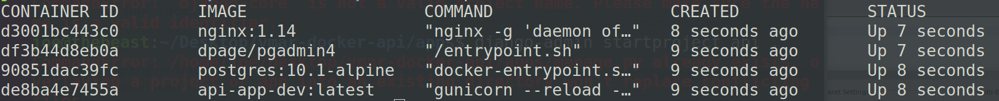

# Django2Pro Container 

#### Overview 

A professional Django2 multi-container system running Docker, Django2.2, NGINX, PostgreSQL, pgAdmin, Python 3.x on https, with support for Dev, QA, & Production environments to build RESTful APIs on. Code updates instantly for quick development: container hot reloads automatically as you write code.

#### Security for Production 

NGINX conf is already configured for strong security so you can goto prod faster. Add new secret-keys each time you spin up a container in the docker cmd's, runs on HTTPs with [DH Params](https://scaron.info/blog/improve-your-nginx-ssl-configuration.html) for increased security. 
See "Strong Security" on NGINX, [here](https://raymii.org/s/tutorials/Strong_SSL_Security_On_nginx.html).


----------------------------------------------------------


### Features

- [Django2](https://www.djangoproject.com/): Django v2.2.3 makes it easier to build better Web apps more quickly and with less code

- [Django Rest Framework](https://www.django-rest-framework.org/): Django REST framework is a powerful and flexible toolkit for building Web APIs

- [NGINX](https://www.nginx.com/): HTTPS reverse proxy server listening for Gunicorn

- [PostgreSQL](https://www.postgresql.org/):  Open source object-relational database system, the auromated build process with Docker will automatically mount & persist the data volumes for you 

- [pgAdmin](https://www.pgadmin.org): pgAdmin is a GUI based management tool for PostgreSQL that allows you to explore, (query) and visualize your database schema internally

- Automatically is config'd to send down JWTs for the front-end

- Swagger & auto doc generation at <url>`swagger-docs/` and <url>/`/docs` to look at and test rest api

- Python 3.6 for Prod: Stable + secure

- Python 3.7 for Dev & QA: Good debugging tools in v3.7 for the developer in you ;)

- [PyDash](https://pydash.readthedocs.io/en/latest/), role filters, CORS support and other cool tools included!

----------------------------------------------------------


### Get Started


#### Step 1 #### 
` git clone git@github.com:joehoeller/Django2Pro-Container.git `
  

#### Step 2 ####
Open the command line and cd into ` /nginx/ssl `, and run these commands to generate a self signed certificate:

- ` openssl req -new -newkey rsa:4096 -x509 -sha512 -days 365 -nodes -out nginx.crt -keyout nginx.key ` 

Generate the DH Params: With Forward Secrecy, if an attacker gets a hold of the server's private key, it will not be able to decrypt past communications. The private key is only used to sign the DH handshake, which does not reveal the pre- master key. Diffie-Hellman ensures that the pre-master keys never leave the client and the server, and cannot be intercepted by a MITM.

- This takes bout 3-5 min to generate, so grab a cup of coffee ;) ` openssl dhparam -out dhparam.pem 4096 `


#### Step 3 ####
Run the following docker commands to kick off the automated build process for each environment, that builds the multiple containers and puts them on a custom Docker network bridge:


   - Dev:  ` env=dev key=YOUR_SECRET_KEY docker-compose build --build-arg VERSION=3.7 `

   - QA:   ` env=qa key=YOUR_SECRET_KEY docker-compose build --build-arg VERSION=3.7 ` (use VERSION=3.6 for Prodcution)

   - Prod: ` env=prod key=YOUR_SECRET_KEY docker-compose build`


NOTE: env sets environment vars from .env files in env folder (dev/qa/prod: you can add custom env vars into those files for your build if you like), key is the custom security hash for Django. We want to keep our security keys off server and not hard coded in files either. ` YOUR_SECRET_KEY ` should contain 30 or more random letters (both upper and lower), numbers and characters for production, and should be new and unique everytime you spin up a container.


#### Step 4 ####
Run container detached: ` env=ENV_NAME key=YOUR_SECRET_KEY docker-compose up -d `
 

#### Step 5 ####
Run ` docker ps ` and you should see some output like this:



** Note the env name is appended to the container names so you can differentiate your env's

#### Step 6 ####
Visit the main url to see its running: ` https://localhost/ `

- Django Rest route list on https: ` https://localhost/api/v1/{ROUTE_NAME}` 

- Django Admin on https: ` https://localhost/admin `

- Swagger: ` https://localhost/swagger-docs/ `

- Auto generated API Docs: ` https://localhost/docs/ `

- pgAdmin for PostgreSQL: ` http://localhost:81/login?next=%2F ` (admin/admin is default user/pass)

* https://localhost/ will return all avail urls

----------------------------------------------------------------

### On first install for database
 
Docker compose doesnt require you to exec into a container, you can run commands outside the container that get executed inside. In order to run `Postgres` we need to migrate the Django models and update it. Once the containers are running on a first time install, type these cmd's in:

- We should migrate our database at this point on Docker:

     ` env=ENV_NAME docker-compose run apps python /apps/manage.py makemigrations --noinput `
     
     ` env=ENV_NAME  docker-compose run apps python /apps/manage.py migrate --noinput `

 
- Next, create a superuser with Docker. Fill out the prompts after running the command below: 

     ` env=ENV_NAME docker-compose run apps python /apps/manage.py createsuperuser `
    

---------------------------------------------------------------

### How to update database and run database migrations using docker-compose
(Same as above)
  
- Set up migration: ` env=ENV_NAME docker-compose run apps python /apps/manage.py makemigrations --noinput `
 
- Commit the changes from Django's ORM to Postgres: ` env=ENV_NAME docker-compose run apps python /apps/manage.py migrate --noinput `
 

----------------------------------------------------------------

### Misc: Troubleshooting Docker conflicts, container errors, volume mappings, etc...

  - Exec into a container:
      Get container name or ID: `docker ps`
      Exec into container: ` docker exec -u root -t -i <container name or id> /bin/bash `
  #

  - Remove all containers:
  
  	```docker rm $(docker ps -a -q)```
  #
  
  - Remove all images:
  
  	```docker rmi $(docker images -a -q)```
  #
  
  - Remove a volume (necessary when re-alloc'ing new file paths for mounted volumes):
  
  	```docker volume ls```
  
  	```docker volume rm volume_name volume_name```
  #

  - Check Django errors:

       ``` env=ENV_NAME docker-compose run apps python manage.py check  ```
  

  
  
  
  
